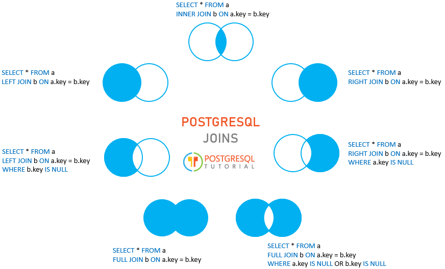

# PostgreSQL
### Table of contents:
  - [SQL commands type](#sql_common)
  - [Data Definition Language, DDL](#ddl)
    - [CREATE/DELETE tables](#cdtables)
    - [CONSTRAINTS](#constraints)
      - PRIMARY/FOREIGN KEYS, UNIQUE, CHECK
  - [Data Query Language, DQL](#dql)
    - [GROUP BY & HAVING](#groupby)
  - [Data Manipulation Language, DML](#dml)
  - [Postgres tools](#postgres_tools)
    - [Common syntax](#syntax)
    - [Dump to CSV](#csv)
    - [Extensions](#extensions)

## <a name='sql_common'></a> SQL commands type
5 Types of Statements:
- DDL - Data Definition Language
- DML - Data Manipulation Language
- DQL - Data query Language
- DCL - Data Control Language
- TCL - Transaction Control Language

## <a name='ddl'></a> Data Definition Language, DDL

#### <a name='cdtables'></a> CREATE/DELETE tables
```
CREATE TABLE employee (
id BIGSERIAL NOT NULL PRIMARY KEY,
first_name VARCHAR(50) NOT NULL,
last_name VARCHAR(50) NOT NULL,
gender VARCHAR(6) NOT NULL,
email VARCHAR(150),
date_of_birth DATE NOT NULL
);

CREATE TABLE bicycle (
id BIGSERIAL NOT NULL PRIMARY KEY,
make VARCHAR(100) NOT NULL,
type VARCHAR(100) NOT NULL,
price NUMERIC(19, 2) NOT NULL
);

DROP TABLE employee;
DROP TABLE bicycle;
```

#### <a name='constraints'></a> ADD/DELETE CONSTRAINTS:
- PRIMARY KEY
  ```
  ALTER TABLE employee DROP CONSTRAINT employee_pkey;
  ALTER TABLE employee ADD PRIMARY KEY(id);
  ```
- FOREIGN KEY
```
// Define
ALTER TABLE employee ADD bicycle_id BIGINT REFERENCES bicycle (id);
ALTER TABLE employee ADD UNIQUE(bicycle_id);

// Create entry
UPDATE employee SET bicycle_id = 2 WHERE id=4;
```
- UNIQUE
```
ALTER TABLE employee ADD CONSTRAINT unique_email_address UNIQUE (email);
```
- ONLY SPECIFIC VALUE
```
ALTER TABLE employee ADD CONSTRAINT gender_constraint CHECK (gender = 'Female' OR gender = 'Male' OR gender = 'Psycho');
```

-----------------------------------------------------
## <a name='dql'></a> Data Query Language, DQL
### SELECT
- Common syntax
  ```
  SELECT *
  FROM table
  JOIN table2 ON [...]
  WHERE [...]
  GROUP BY [...]
  HAVING [...]
  ORDER BY [...]
  LIMIT [...]
  ```
- ORDER BY
  ```
  SELECT * FROM employee ORDER BY country_of_birth; (defaul ASC)
  SELECT * FROM employee ORDER BY country_of_birth DESC;
  ```

- DISTINCT-ONLY (Only unique result)
  ```
  SELECT DISTINCT country_of_birth FROM employee ORDER BY country_of_birth;
  ```
- WHERE
  ```
  SELECT * FROM employee WHERE gender = 'Female' AND (country_of_birth = 'Argentina' OR country_of_birth = 'Brazil');
  ```
- LIMIT
  ```
  // Will return from 11th to 15th employees
  SELECT * FROM employee OFFSET 10 LIMIT 5;
  // or
  SELECT * FROM employee OFFSET 10 FETCH FIRST 5 ROW ONLY;
  ```
- IN - is short version of OR-OR-OR
  ```
  SELECT * FROM employee WHERE country_of_birth IN ('China', 'Argentina', 'Brazil');
  ```
- BETWEEN
  ```
  SELECT * FROM employee WHERE date_of_birth BETWEEN '2019-01-01' AND '2023-01-01';
  ```
- LIKE & ILIKE
  ```
  SELECT * FROM employee WHERE email LIKE '%@gmail.%';
  SELECT * FROM employee WHERE email ILIKE '%@gmail.%'; (the same but without register)
  ```
- GROUP BY, COUNT & HAVING
  ```
  SELECT country_of_birth, COUNT(*) FROM employee
  GROUP BY country_of_birth HAVING COUNT(*) > 10 ORDER BY country_of_birth;
  ```
- COASLESCE - default value substitute === Null (! NOT empty string "", not string "NULL")
  ```
  SELECT first_name, COALESCE(email, 'not applicable') as extended_email FROM employee;
  ```
- MATH
  ```
  SELECT MIN(price) FROM holiday;
  SELECT MAX(price) FROM holiday;
  SELECT ROUND(AVG(price)) FROM holiday;
  SELECT destination_country, SUM(price) FROM holiday GROUP BY destination_country;
  SELECT num1 {*, \, +, -, %, !} num2
  ```

#### Joins
```
// inner
SELECT employee.first_name, bicycle.make, bicycle.type, bicycle.price FROM employee
JOIN bicycle ON employee.bicycle_id = bicycle.id;

// left
SELECT employee.first_name, bicycle.make, bicycle.type, bicycle.price FROM employee
LEFT JOIN bicycle ON employee.bicycle_id = bicycle.id;

// right
SELECT employee.first_name, bicycle.make, bicycle.type, bicycle.price FROM employee
RIGHT JOIN bicycle ON employee.bicycle_id = bicycle.id;

// full
SELECT employee.first_name, bicycle.make, bicycle.type, bicycle.price FROM employee
FULL OUTER JOIN bicycle ON employee.bicycle_id = bicycle.id;
```


#### Date
- Just get date()
```
SELECT NOW()[::{DATE, TIME}];
```
- Go to the past on expressed time
```
// (For future use "+")
SELECT NOW() - INTERVAL '10 {YEAR, MONTHS, DAYS}';
```
- Get specific parameter from data
```
// Possible parameters: (day of the week (first sunday))
SELECT EXTRACT({YEAR, MONTH, DAY, DOW} FROM NOW());
```
- get difference between 2 dates - AGE
```
SELECT first_name, last_name, gender, country_of_birth, AGE(NOW(), date_of_birth) as age FROM employee;
```

-----------------------------------------------------
## <a name='dml'></a> Data Manipulation Language, DML
#### INSERT
```
INSERT INTO employee (first_name, last_name, gender, email, date_of_birth, country_of_birth) VALUES ('Ari', 'Hay', 'Male', 'panda@pcworld.com', '2022/07/27', 'USA');
```

#### DELETE
```
DELETE FROM employee WHERE email LIKE '%@google%' AND country_of_birth = 'China';
```

#### UPDATE
```
UPDATE employee SET gender='Psycho' WHERE gender in ('Genderqueer', 'Panda', 'Bigender', 'Genderfluid', 'Polygender', 'Non-binary', 'Agender');
```

#### ON CONFLICT DO
```
// UPDATE IF ENTRY EXIST (UPSERT)
INSERT INTO employee (id, first_name, last_name, gender, email, date_of_birth, country_of_birth)
VALUES (1, 'Jocker', 'Doe', 'Male', 'john.doe@google.com', DATE '2019-12-10', 'Russia')
ON CONFLICT (id) DO UPDATE SET email = EXCLUDED.email, first_name = EXCLUDED.first_name, gender = EXCLUDED.gender;

P.S. Also possible ways:
- ON CONFLICT DO NOTHING;
```

-----------------------------------------------------
## <a name='postgres_tools'></a> Postgress tools
#### <a name='extension'></a> Common syntax
- `\d [table_name]` - see all tables, or structure of specific table
- `\dt` - see all tables, but without additional
- `\i /path/to/file.sql` - import file, and execute content
- `\copy ... TO /path/to/dump_file` - for dump

#### <a name='csv'></a> DUMP TO CSV
```
\copy (SELECT * FROM employee JOIN bicycle ON employee.bicycle_id = bicycle.id)
TO '/home/inauris/projects/1.csv' DELIMITER ',' CSV;
```

#### <a name='extension'></a> Extensions
- See list of extensions:
```
SELECT * FROM pg_available_extensions;
```
- Install extension:
```
CREATE EXTENSION IF NOT EXISTS "uuid-ossp";
```
- Usage example:
```
// see result
SELECT uuid_generate_v4();

// practical usage
INSERT INTO passport (passport_serial, issue_date, expire_date, country_of_issue) VALUES
(uuid_generate_v4(), '2020_09_03', '2045_09_03', 'USA');
```
